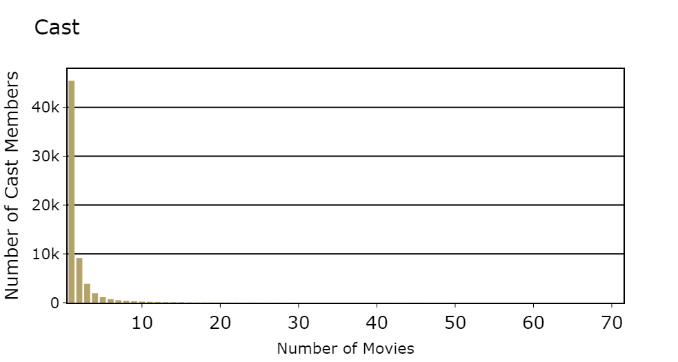

By: Simon Mei, Walter Disharoon, Jerome Perera, Ankith Kanderi, and Himnish Kapoor

Project Proposal Recording:
[Youtube Link](https://youtu.be/j-8RxawvbOY)
### **Introduction:**  

Currently, the primary goal of movies is to maximize profit for the studios and companies who create them. In order to achieve this goal, movie studios want to use machine learning to maximize box office revenue.   

Nowadays, Hollywood has already become familiar with machine learning and there exist models to estimate a films’ projected box office[^1] as well as a movie’s projected rating[^2]. However, while there exist lots of predictive and generative forms of machine learning used in the industry, our project will focus more on using data to determine key factors that affect a movie’s revenue.  

Our proposed dataset is The Movies Dataset from Kaggle by Rounak Banik[^3]. This dataset contains metadata for 45,000 movies. Some of the important features of this dataset include things such as casting crew, directors, advertising budget, and, most importantly to our project, revenue. 

### **Problem Definition:**  

The goal of this project is to use both supervised and unsupervised learning to determine the various elements, and their corresponding importance, that contribute to a monetarily successful movie. More specifically, the findings of this project should give movie studios a better understanding of factors to consider when creating movies. This is different from the many other movie-related models out there that simply state whether a movie is expected to be successful or not, because the findings of this project are more about providing the movie industry with information for future decisions.  

### **Methods:** 

#### **Data Collection, Cleaning, and Visualization**
The movies dataset contains metadata for over 45,000 movies. Unfortunately though the dataset is provided in multiple separate csv's in a somewhat unwieldy state. The data collection and cleaning process was as follows:

1. import the csv's as pandas dataframes
2. remove entries from the csv's with duplicate movie IDs
3. Drop non-sensical features for prediction such as: alternative id, homepage, poster_path, status, tagline, etc.
4. Replace missing/empty features with NaN. This will make later training easier

Once this step is complete, many of the features that could be useful are saved in a JSON format that is not useful for training. So we:

5. Since we are trying to predict movie profitability we would want to cull features that come after the release of the movie such as voting averages and vote count; and features that are uncontrollable like "release year".
6. Extract and interpret the JSON's in the credits.csv into new features such as "Director", "Cast List", "Crew Size", "Cast Size".
7. Extract the month published from the dates column
8. Extract the output "Profit" as "Revenue" - "Budget".

Unfortunately only 5371 entries out of the initial 45000 have data for revenue and budget to extract profit, which does severly lower the dataset size. After acquiring this initial cleaned dataset the features present are:

1. Budget
2. Production Countries
3. Runtime
4. Spoken Languages
5. Cast and Crew sizes
6. Director
7. Release Month
8. List of Cast
9. List of Production Companies
10. Genres

Afterwards before any modeling or training takes place we encode the features in the following way:

1. Budget, Runtime, and Cast size, and Crew Size are encoded as real numbers
2. Production Countries, Spoken Languages, Release Month, and Directors are encoded categorically
3. Cast, Genres, and Production Companies are one-hot-encoded since they have multiple entries inside

Bar charts for the genres, cast and crew sizes, directors, budgets, and runtime are shown below.

We did notice a large portion of the cast members having very few movies, so we culled the cast members with less than 20 movies, and similarly with production companies with less than 10 movies as they would not be useful for training or testing with very little entries. Finally at this point we filled any NaN entries with the average value for runtime, and one hot encoded the cast, genres, and production companies.

#### **Both:** 

Both supervised and unsupervised learning will require cleaning the dataset and performing feature engineering to decide how to use the individual features. This stage will include visualizations and statistical analysis to decide on worthwhile features towards predicting movie financial success. 

#### **Supervised Learning:** 

For supervised learning the methods utilized is planned to be ensemble learning. Ensemble learning will encompass implementing multiple different methods of solving the regression problem and utilizing the different regression methods to decide on an output. Utilizing ensemble methods, like stacking, will allow for easy comparison between individual methods, and if combining those methods leads to a better solution in terms of modeling the success of the movie. 

##### **Unsupervised Learning:** 

Unsupervised learning will be utilized to look for patterns in the movies utilizing clustering, or to deal with outlier movies with anomaly detection methods.  Gower distance[^4] could be useful to deal with both the categorical and numerical data present. 

### **Potential Results and Discussion:** 

#### **Supervised Learning:** 

Evaluating supervised learning for monetary success can be simply done by looking at the mean squared error between the actual performance and the expected performance in the testing set. By comparing the ensemble method and the individual methods making up the ensemble, we can decide on the best method and evaluate the success of various methods on the problem. 

#### **Unsupervised Learning:** 

Unsupervised learning can be evaluated using standard clustering metrics such as silhouette coefficient or the Davies-Bouldin index. For anomaly detection evaluation will be more qualitative and focused on improved visualization and results. 

### **Timeline:**

[Gantt Chart](GanttChart.zip)

#### **Contribution Table:**

Walter | Ankith | Simon | Jerome | Himnish
--- | --- | --- | --- |---
Methods, Potential Results, Video Clips | Introduction, Problem Definition, Video Clips | Dataset, References | Video Creation, GitHub Page | Video Creation, GitHub Pages

#### **References:**

[^1]:	N. Darapaneni et al., "Movie Success Prediction Using ML," 2020 11th IEEE Annual Ubiquitous Computing, Electronics & Mobile Communication Conference (UEMCON), New York, NY, USA, 2020, pp. 0869-0874, doi: 10.1109/UEMCON51285.2020.9298145.
[^2]:	R. Dhir and A. Raj, "Movie Success Prediction using Machine Learning Algorithms and their Comparison," 2018 First International Conference on Secure Cyber Computing and Communication (ICSCCC), Jalandhar, India, 2018, pp. 385-390, doi: 10.1109/ICSCCC.2018.8703320.
[^3]:	R. Banik, 2017, “The Movies Dataset” Kaggles. [Online]. Available: https://www.kaggle.com/datasets/rounakbanik/the-movies-dataset
[^4]:	Gower, J. C. (1971). A General Coefficient of Similarity and Some of Its Properties. Biometrics, 27(4), 857–871. https://doi.org/10.2307/2528823

 

 

 

 

 

 
